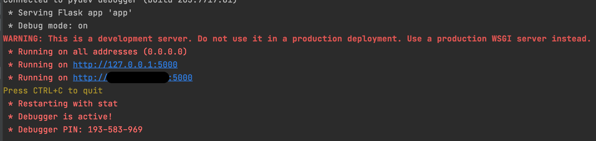
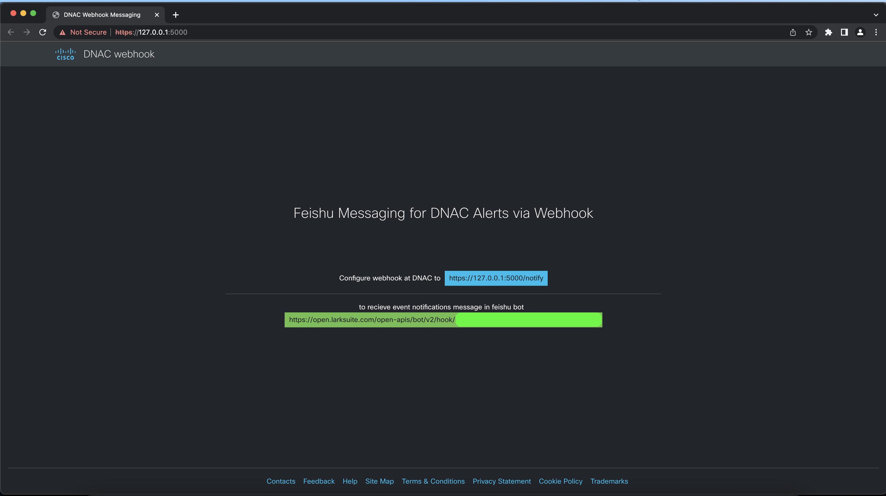
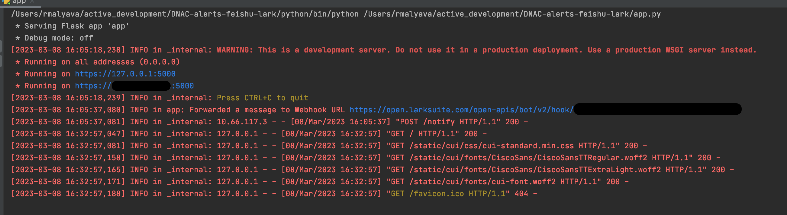
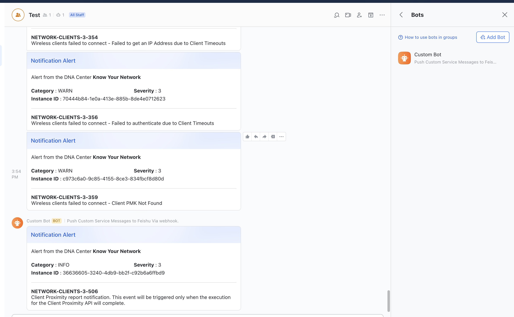

## gve_devnet_dnac_webhook_for_feishu_lark_messaging 
An intermediate web server or application which acts as an forwarder for processing REST event notifications received from Cisco DNA center, by converting the recieved message into Message format of Feishu/Lark Application.


## Contacts
* Raveesh Malyavantham V

## Solution Components
* Python
*  Flask
*  Feishu/Lark Messaging API

## Related Sandbox Environment
This is as a template, project owner to update
This sample code can be tested using a Cisco dCloud demo instance that contains ** *Insert Required Sandbox Components Here* **

## Prerequisites
**DNA Center Credentials**: In order to use the DNA Center APIs, you need to make note of the IP address, username, and password of your instance of DNA Center. Note these values to add to the credentials file during the installation phase.

## Installation/Configuration
1. Clone this repository with `git clone [repository name]`
2. Set up a Python virtual environment. Make sure Python 3 is installed in your environment, and if not, you may download Python [here](https://www.python.org/downloads/). Once Python 3 is installed in your environment, you can activate the virtual environment with the instructions found [here](https://docs.python.org/3/tutorial/venv.html).
3. Install the requirements with `pip3 install -r requirements.txt`
4. Update the service now host details in ```.env``` file.
    ```
    FEISHU_BOT_WEBHOOK_URL = https://open.larksuite.com/open-apis/bot/v2/hook/xxxxxxxx-xxxx-xxxx-xxxx-xxxxxxxxxxxx
    ```
   instructions on setting up custom bot in Feishu or Lark, please refer [here](https://open.larksuite.com/document/ukTMukTMukTM/ucTM5YjL3ETO24yNxkjN?lang=en-US)  
5. To enable https:// for the application. The application may require ssl key and certificate files
   ```
    HTTPS_ENABLED = True
    CERT_PATH = cert.pem
    KEY_PATH = key.pem
    ```
   to generate self-signed custom certificate using openssl, run the following command in terminal and provide asked parameters.
   ```
   openssl req -x509 -newkey rsa:4096 -nodes -out cert.pem -keyout key.pem -days 365
   ```

### Setting up webhooks at Cisco DNA Center
For detailed instructions on setting up event webhook notification at cisco DNA center.   
1. Click [here](https://www.cisco.com/c/en/us/td/docs/cloud-systems-management/network-automation-and-management/dna-center-platform/2-3-5/user-guide/b-dnac-platform-ug-2-3-5/b-dnac-platform-ug-2-3-5-chapter-0101.html#Cisco_Task_in_List_GUI.dita_e24b1b78-ea6e-4aa5-932a-359e04d4122f) for setting up destination for webhook  
2. Click [here](https://www.cisco.com/c/en/us/td/docs/cloud-systems-management/network-automation-and-management/dna-center-platform/2-3-5/user-guide/b-dnac-platform-ug-2-3-5/b-dnac-platform-ug-2-3-5-chapter-0111.html#Cisco_Task_in_List_GUI.dita_ca236611-5a22-4c83-9a65-22d98a28b98e) for Developer Tookit options

## Usage
To run the code, use the command:
```
$ python3 app.py
```

# Screenshots

#### Running ```app.py```


#### Instructions or Landing page


#### Logging in file if FLASK_DEBUG is enabled during webhook processing


#### Sample Notification received in Lark or Feishu Appliation


### LICENSE

Provided under Cisco Sample Code License, for details see [LICENSE](LICENSE.md)

### CODE_OF_CONDUCT

Our code of conduct is available [here](CODE_OF_CONDUCT.md)

### CONTRIBUTING

See our contributing guidelines [here](CONTRIBUTING.md)

#### DISCLAIMER:
<b>Please note:</b> This script is meant for demo purposes only. All tools/ scripts in this repo are released for use "AS IS" without any warranties of any kind, including, but not limited to their installation, use, or performance. Any use of these scripts and tools is at your own risk. There is no guarantee that they have been through thorough testing in a comparable environment and we are not responsible for any damage or data loss incurred with their use.
You are responsible for reviewing and testing any scripts you run thoroughly before use in any non-testing environment.